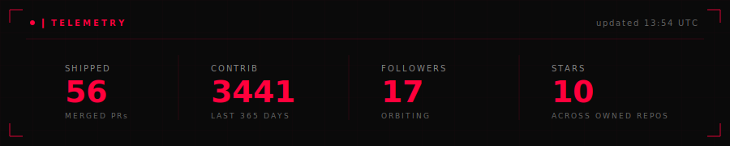

 

 

> **Most of the code I run, you cannot see.**

Independent engineer in Canada. I build reasoning systems for operators — tools that compress what a research desk does into something a single person can run. Anteroom Studio is the studio. ZAI is what is inside it. The public surface below is the half I am willing to put a name on.

Longer answer: [WHO.md](./WHO.md).

 

 

### <kbd>▎</kbd> Not open to work

<table>
  <tr>
    <td width="50%" valign="top" style="border-top: 2px solid #ff003c;">

#### `>` [zhub](https://github.com/Zawwarsami16/zhub)

WiFi for AIs. Turn any AI into a discoverable, OpenAI-compatible endpoint in three commands.

 

</td>
    <td width="50%" valign="top" style="border-top: 2px solid #ff003c;">

#### `>` [pocket](https://github.com/Zawwarsami16/pocket)

Browser-only AI chat. Bring your own key, nothing leaves the device. [Live.](https://pocket-tau-sepia.vercel.app)

 

</td>
  </tr>
  <tr>
    <td width="50%" valign="top">

#### `>` [htb-progress](https://github.com/Zawwarsami16/htb-progress)

Hack The Box notebook. The patterns folder grows faster than the writeups one. That is on purpose.

 

</td>
    <td width="50%" valign="top">

#### `>` [engineering-portfolio](https://github.com/Zawwarsami16/engineering-portfolio)

Personal site. [zawwarsami.com](https://zawwarsami.com).

 

</td>
  </tr>
  <tr>
    <td width="50%" valign="top">

#### `>` [Zai-Hacking-game](https://github.com/Zawwarsami16/Zai-Hacking-game)

Terminal-feel hacker RPG. Real shell, fake stakes.

 

</td>
    <td width="50%" valign="top">

#### `>` on the bench

Anteroom Oracle. Daily Anthropic SDK / vercel / ollama work. Climbing HTB. Writing *Unwrapping What Exists* on the side.

 

</td>
  </tr>
</table>

 

 

 

<picture>
  <source media="(prefers-color-scheme: dark)" srcset="https://raw.githubusercontent.com/Zawwarsami16/Zawwarsami16/output/github-contribution-grid-snake-red.svg" />
  <source media="(prefers-color-scheme: light)" srcset="https://raw.githubusercontent.com/Zawwarsami16/Zawwarsami16/output/github-contribution-grid-snake-red.svg" />
  
</picture>

 

 

&nbsp;
&nbsp;
&nbsp;
&nbsp;
&nbsp;

 
 

<code>echo $USER && uname -a</code> · <a href="https://komarev.com/ghpvc/?username=Zawwarsami16&color=ff003c&style=flat-square&label=visitors">visitors</a>

